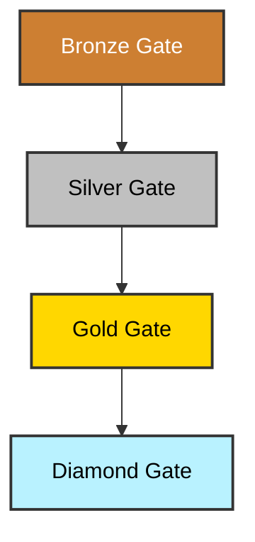

# 🕸 TRUSTINT — Trust Intelligence Daemon (TID)

[](https://github.com/MYTHIK-blip/TRUSTINT/releases/tag/bronze-gate-v0.1)
[]()
[](https://www.python.org/downloads/release/python-3120/)
[](https://github.com/psf/black)
[](http://mypy-lang.org/)
[](LICENSE)
[](LICENSE-DOCS)

> TRUSTINT at Bronze is a **living covenant + working daemon**: Deterministic, legally shielded, provenance-enforced, and real-world applicable.

---

## ✍️ Author & Stewardship
- **Author:** Kerehama Mcleod (aka _MYTHIK_)
- **Role:** Architect of Trust Intelligence Systems
- **Stewardship model:** Operators are **stewards, not owners**. Provenance is mandatory.

---

## 📜 Citation
If referencing TRUSTINT in research or governance work, please cite as:

> Mcleod, Kerehama (_MYTHIK_). **TRUSTINT — Trust Intelligence Daemon (TID).**
> A covenantal system for provenance, LAW sovereignty, and collapse-aware continuity.
> AGPLv3 + CC BY-SA 4.0. GitHub, 2025.

---

## 💡 Key Concepts

### 🌐 Vision
TRUSTINT is a **Trust Intelligence Architecture** — a covenantal system that models, manages, and preserves **assets, roles, laws, and compliance** across generations. It is not a trust itself, but a **Trust Intelligence Daemon (TID)** composed of three core layers:

- 🏛 **Substrate (TIS)** — The database and schema layer for codified trusts.
- 🕸 **Lattice (TIL)** — The governance validation and rule enforcement engine.
- 🔢 **Matrices (TIM)** — The system for exports, simulations, and board-ready reports.

### 🎯 Purpose
- Codify trust logic into **deterministic, auditable pipelines**.
- Preserve **provenance** across every artifact, deed, and decision.
- Validate roles, assets, and obligations against explicit **schemas + rule checks**.
- Provide **tamper-evident vaults** and **exportable board reports**.
- Enable **continuity under disruption** (public-domain fallback on systemic failure).

### 🧬 Ethos
- ✅ Integrity first — licenses + covenant before operations.
- ✅ Provenance mandatory — signed commits, checksums, append-only ledger.
- ✅ Idempotency — reproducible outputs; no silent black-boxing.
- ✅ Continuity under collapse — defaults to public-domain accessibility.
- ✅ Stewardship — multi-party, accountable governance.

### 🌍 Sovereignty Layers (LAW)
TRUSTINT encodes **Land · Water · Air** domains:
- **Land** — estates, whenua, tangible infrastructures.
- **Water** — freshwater, coastal zones, rights of use & stewardship.
- **Air** — privacy corridors, airspace easements, drone boundaries (0–120m AGL).

### 🧑‍⚖️ Real-World Use (Chairman’s View)
- **Clarity & Oversight** — single source of truth for instruments; cross-jurisdiction visibility.
- **Defensive Posture** — tamper-evident vault; air/water clauses; legislative hooks.
- **Operational Efficiency** — deterministic validation; board exports; reproducible packaging.
- **Strategic Leverage** — covenantal enforcement; multi-party stewardship; collapse continuity.

---

## 🚀 Getting Started

### 1. Prerequisites
- Python 3.12+
- `make`

### 2. Installation
Clone the repository and run the setup command. This will create the virtual environment and install all necessary dependencies.
```bash
make setup
```

### 3. Configuration & First Run
The core configuration for your trusts, assets, roles, and laws is managed in the `config/` directory. For a complete walkthrough, please refer to the full **Operator's User Guide**.

---

## 📖 Documentation

This project's documentation is organized to provide comprehensive guidance on its architecture, operation, and policies.

| Document                                                              | Description                                                                                         |
| :-------------------------------------------------------------------- | :-------------------------------------------------------------------------------------------------- |
| [**Operator's User Guide**](docs/USER_GUIDE_2025-10-06T07-18-23Z.md)   | **(Start Here)** A full guide to setup, architecture, CLI commands, and troubleshooting.            |
| [**Architectural Decisions (ADRs)**](docs/adr/README.md)              | The rationale and context for key architectural decisions that have shaped the system.              |
| [**Main Documentation Index**](docs/README.md)                        | The central entry point and map to all project documentation.                                       |

---

## 🛠️ Technical Details

### 📂 Repository Structure
    TRUSTINT/
    ├── config/           # YAML files for trusts, roles, assets, laws.
    ├── core/             # Core application logic (ingest, validate, export).
    ├── scripts/          # CLI entrypoints and utility scripts.
    ├── vault/            # Tamper-evident storage (database, ledger, keys).
    └── ...

### 🧩 Config Schema (Bronze)
A quick reference for the core YAML configuration:
**`trusts.yaml`**: `{slug, name, purpose, jurisdiction}`
**`roles.yaml`**: `{trust, role, party, powers}`
**`assets.yaml`**: `{trust, class, descriptor, jurisdiction, metadata}`
**`laws.yaml`**: `{jurisdictions, obligations: {trust, name, kind, schedule, ...}}`

### 🔐 Provenance & Integrity
- **Ledger:** `vault/events.jsonl` — append-only HMAC chain (prev → mac).
 - **Checksums:** `dist/SHA256SUMS` — SHA256 for exported artifacts.
 - **Vault:** content-addressed paths for evidence and references.
- **Keys:** HMAC key resolution order:
   1. `TRUSTINT_HMAC_KEY` (env var: base64url or hex)
   2. `TRUSTINT_HMAC_KEY_FILE` (env var: path to key file)
   3. `vault/.hmac_key` (file: base64url, hex, or binary)

### 🔬 Tooling & Policy
- **Pre-commit:** Black, Ruff (auto-fix), Mypy, YAML checks.
- **Testing:** Pytest with golden-file snapshots encouraged.
- **Style:** Python 3.12, Ruff line-length 100, strict-lean types.

---

## 🗺️ Roadmap & Releases

### 🪜 Bronze → Silver → Gold → Diamond
- **Bronze (current):** Working daemon — ingest, validate, export, provenance; LAW seeded.
- **Silver:** Multi-trust lattice, jurisdiction overlays, TenderBotNZ integration, richer obligations.
- **Gold:** Simulation matrices (PvP/PvE/systemic shocks), multi-lattice governance.
- **Diamond:** Adaptive AI-driven compliance/resilience matrices; autonomous provenance vaulting.

### ✨ Future Horizons
- **CLI → UI → UX Evolution**: The current powerful CLI is the foundation for a future, intuitive graphical user experience. The goal is to provide a seamless workflow for operators of all technical levels.
- **Front-End Integration**: A web-based front-end is a primary goal for enhancing usability. This could be built with modern frameworks like React or Vue, or explore powerful data visualization libraries such as Palantir's `witchcraft.js` to create rich, interactive dashboards.
- **Digital Asset Management**: The architecture is designed to be extensible. Future versions will aim to incorporate the management of digital and cryptographic assets (e.g., cryptocurrencies, NFTs, digital deeds) into the same secure provenance framework.

### 🧭 Roadmap (Mermaid source)


### 📦 Artifact Provenance (Release Ritual)
- Tag gate: `bronze-gate-v0.1`
- Build tarball in `dist/` with exports + `SHA256SUMS`
- Emit `.sha256` and (optional) `.sha512`
- Signed tag/commit if GPG available
- Freeze `bronze` branch as rollback line

---

## 📜 Licenses & Covenant
- **Code → AGPLv3** (`LICENSE`) — ensures openness; prevents SaaS enclosure.
- **Docs → CC BY-SA 4.0** (`LICENSE-DOCS`) — ontology + cultural artifacts remain libre with attribution.
- **Covenant → `ADDENDUM.md`** — provenance, collapse continuity, exportability, AI obligations.

***
