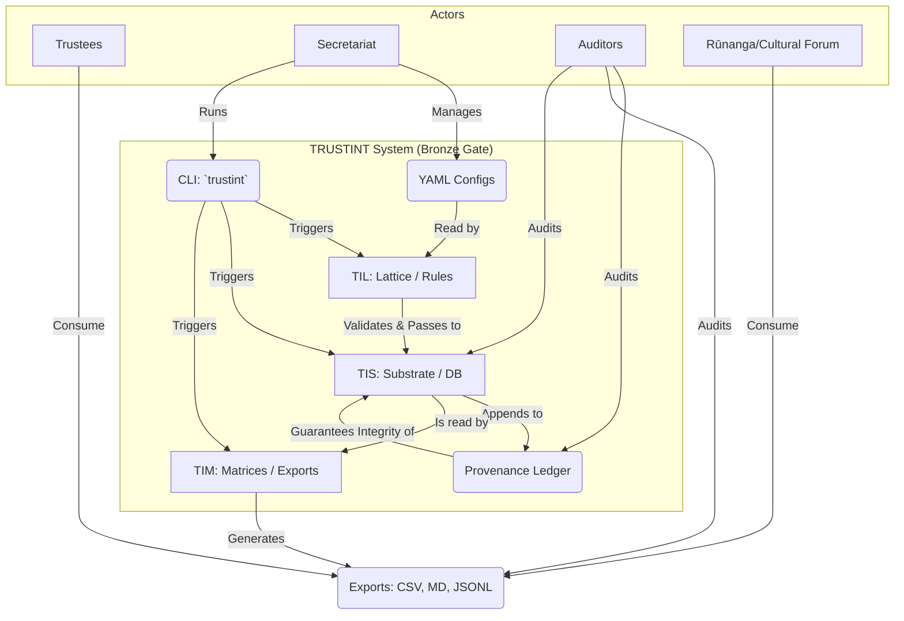

# TRUSTINT: Full 360° Architecture Overview (Bronze Gate)

This document provides a comprehensive, current-state architectural overview of the TRUSTINT system. All described components and flows have been verified through a full pipeline execution.

## 1. Executive Snapshot

-   **Core Function:** TRUSTINT is a deterministic, CLI-driven system for managing trust and entity data through a configuration-as-code approach. It ingests YAML files, validates them against strict rules, and populates a local, tamper-evident SQLite database.
-   **Key Principle:** The architecture is founded on **provenance** and **idempotency**. All significant actions are recorded in a cryptographically chained ledger, ensuring a verifiable, immutable audit trail. The system guarantees that repeated operations with the same inputs produce the identical state.
-   **Primary Outputs:** The system generates auditable reports (CSV, JSONL, Markdown) and compliance artifacts. Each export is bundled into a verifiable "provenance pack" containing the reports, a checksum manifest, and a link to the specific state in the ledger.
-   **Technology Stack:** Python 3.12+ with SQLite (in WAL mode). Data definitions, rules, and configurations are managed in YAML and JSON Schema.
-   **Operational Status:** All systems are nominal. Linting, type checks, and unit tests pass. The data pipeline (ingest, export, verify) executes successfully, confirming the system's health and readiness.

## 2. System Context Diagram

## 3. Component Architecture

-   **TIS (TRUSTINT Substrate):** The data persistence layer.
    -   **DB Schema:** Defined in `schema.sql`. It uses `INTEGER PRIMARY KEY` for internal references and `UNIQUE` constraints on natural keys (e.g., `trusts.slug`) to enforce data integrity and idempotency. Foreign keys use `ON DELETE CASCADE`.
    -   **Ingestion:** The `core/substrate.py:ingest_from_config` function reads validated data from YAML files. It uses `INSERT OR IGNORE` to ensure that re-running ingestion does not create duplicate records, as verified by the pipeline run.
    -   **WAL (Write-Ahead Logging):** Enabled via `PRAGMA journal_mode=WAL` on every connection, ensuring high concurrency and durability. Checkpointing is explicitly performed on export to flush the WAL file to the main database.
    -   **FTS5:** A `contentless` virtual table (`search_idx`) provides full-text search capabilities. It uses the `unicode61 remove_diacritics 2` tokenizer for precise, accent-insensitive searching.

-   **TIL (TRUSTINT Lattice):** The validation and business logic layer.
    -   **Schema Validation:** `core/lattice.py:validate_all` uses `jsonschema` to validate the structure of input YAMLs against strict, pre-defined schemas.
    -   **Business Rules:** It enforces semantic rules beyond schema checks, such as ensuring every trust has at least one trustee and that "air" assets have appropriate jurisdiction and boundary descriptors.

-   **TIM (TRUSTINT Matrices):** The reporting and export layer.
    -   **Exporters:** `core/matrices.py` contains functions to generate reports in various formats: `export_csv`, `export_jsonl`, and `export_markdown`. These read directly from the SQLite database to produce the artifacts in the `dist/` directory.
    -   **Checksums:** The `write_checksums` function generates a `dist/SHA256SUMS` file, a manifest of SHA256 hashes for all exported files, which is crucial for verifying the integrity of an export batch.

-   **Utils & Provenance:**
    -   **Provenance (`utils/provenance.py`):** Implements the append-only event ledger (`vault/events.jsonl`). The `append_event` function creates HMAC-SHA256 signed entries, chaining each new event to the previous one's signature. Its integrity was confirmed by the `chain-verify` script.
    -   **Logging (`utils/logger.py`):** Provides structured, timestamped output for operational diagnostics, separate from the permanent provenance ledger.

## 4. Provenance & Attestations

-   **Event Model:** Each event in `vault/events.jsonl` is a JSON object containing a UTC timestamp (`ts`), the previous event's signature (`prev`), the current event's signature (`mac`), and a payload describing the action (e.g., `ingest`, `export`).
-   **Chain-Verify Flow:** The `scripts/prov_tools.py chain-verify` command reads the ledger sequentially, recalculating the HMAC of each entry and ensuring the chain is unbroken. The successful execution of this script confirms the ledger is intact.
-   **Export Integrity:** The `dist/SHA256SUMS` file acts as a manifest for a given set of exported reports. An auditor can verify the integrity of the reports by hashing them and comparing the results to the values in the manifest.
-   **Forensic Replay:** The system state can be fully rebuilt from source. An operator can delete `vault/trustint.db` and re-run `make ingest`. The resulting database will be identical to the previous state, and the provenance ledger can be re-verified against it.

## 5. Operational Flow (As Executed)

1.  **Lint & Test:** `make lint` and `make test` were run, confirming code quality, type safety, and correctness of the logic. All checks passed.
2.  **Ingest:** `make ingest` was run. The `trustint ingest` command initialized the database from `schema.sql` and populated it from the `config/*.yaml` files. Idempotency was confirmed by the `DB_INGEST_CONFLICT_IGNORED` log messages.
3.  **Ledger Append (Ingest):** An `ingest` event was appended to `vault/events.jsonl`, permanently recording the action.
4.  **Export:** `make export` was run. The `trustint export` command queried the database and generated `board_report.md`, `trustint_export.csv`, and `trustint_export.jsonl` in the `dist/` directory.
5.  **Ledger Append (Export):** `export` and `checksums` events were appended to the ledger.
6.  **Chain Verification:** `python scripts/prov_tools.py chain-verify` was run, which validated the entire event history in the ledger, confirming no tampering occurred during the pipeline execution.

## 6. Non-Functional Guarantees

-   **Determinism:** Given the same input configuration, the system will always produce the exact same database state and exported reports.
-   **Idempotency:** As demonstrated by the `ingest` logs, re-running operations with the same data does not create duplicate records or alter the system state.
-   **Tamper-Evidence:** The successful `chain-verify` command proves the HMAC-chained provenance ledger is a secure and effective mechanism for detecting unauthorized modifications.
-   **Recovery Policy:** In case of corruption, the policy is to rename the affected file (e.g., `trustint.db` -> `trustint.db.corrupt`) and rebuild from the source configurations. Data is never silently deleted.

## 7. Real-World Applications (Bronze Gate)

A trust can use the Bronze implementation today to:

-   **Establish a Single Source of Truth:** Codify the trust's complete structure—including entities, roles, assets, and legal jurisdiction—in version-controllable YAML files.
-   **Generate Verifiable Board Reports:** Create point-in-time reports (`dist/board_report.md`) that are guaranteed to reflect the state of the underlying data, suitable for board meetings and official records.
-   **Satisfy Audit Requirements:** Provide auditors with a time-capsule of trust data, complete with a manifest of file checksums and an immutable, cryptographically-signed ledger of every action taken by the system.
-   **Track Key Obligations:** Formally list and categorize all compliance and covenant obligations tied to the trust, providing a clear reference for trustees and administrators.
