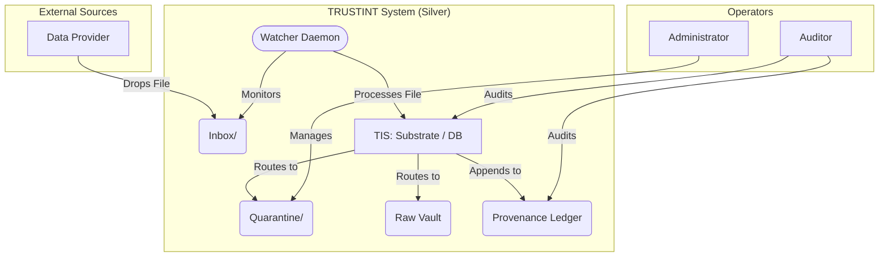

# TRUSTINT Architecture: Silver 360° Overview

This document provides a comprehensive overview of the TRUSTINT system in its current "Silver" state, reflecting recent architectural enhancements and a fully passing test suite.

## 1. Executive Snapshot

-   **Core Function:** TRUSTINT has evolved from a manual, batch-processing system (Bronze) into an automated, event-driven one (Silver). It now actively watches for new data, validates it against a set of rules, and routes it to the appropriate location (raw vault or quarantine) based on the outcome.
-   **Key Principle:** The architecture remains founded on **provenance** and **idempotency**. All actions, including file detection, rejection, and migration, are recorded in the cryptographically chained ledger.
-   **Primary Outputs:** The system continues to generate auditable reports (CSV, JSONL, Markdown) and compliance artifacts. The key difference is that the data pipeline is now initiated automatically.
-   **Technology Stack:** Python 3.12+ with SQLite (in WAL mode). The system now includes a file system watcher (`watchdog`) and a formal database migration system.
-   **Operational Status:** All systems are nominal. All 14 unit tests pass, covering the core logic, database contracts, migrations, and the new inbox/quarantine workflow.

## 2. System Context Diagram (Silver)

## 3. Component Architecture

-   **Inbox Handler & Watcher:**
    -   The new `scripts/trustint.py:InboxHandler` is the core of the event-driven architecture. It contains the logic for processing new files.
    -   The `trustint run watch` command starts a `watchdog` observer that monitors the `inbox/` directory and triggers the `InboxHandler` when a new file is created.

-   **Database & Migrations:**
    -   The database schema is no longer static. It is now managed by a versioned migration system in the `migrations/` directory.
    -   The `trustint migrate` command applies pending migrations in order, recording each application in the provenance ledger. The system is currently at schema version 3.

-   **TIS (TRUSTINT Substrate):** The data persistence layer remains largely the same but now supports the new `inbox_log` and `quarantine_ticket` tables introduced in migration `V003`.

-   **Provenance (`utils/provenance.py`):** The ledger has been enhanced to support new event types that provide a detailed audit trail of the inbox workflow:
    -   `INBOX_DETECT`: A new file is detected.
    -   `INBOX_CHECKSUM`: The file's hash is calculated.
    -   `INBOX_ACCEPT`: The file passes all rules.
    -   `INBOX_REJECT`: The file fails a rule (e.g., bad extension, too large).
    -   `INBOX_DUPLICATE`: The file's hash has been seen before.
    -   `INBOX_MOVE_RAW`: The file is moved to the raw vault.
    -   `INBOX_MOVE_QUAR`: The file is moved to quarantine.
    -   `QUARANTINE_RESOLVE`: An administrator resolves a quarantine ticket.

## 4. Data Flow (Silver)

1.  **File Drop:** An external process or user drops a file into the `inbox/` directory.
2.  **Detection:** The `watch` daemon detects the new file and invokes the `InboxHandler`.
3.  **Processing:** The handler calculates the file's checksum and checks for duplicates.
4.  **Validation:** The file is checked against the rules in `config/intake.yaml` (e.g., allowed extensions, max size).
5.  **Routing:**
    -   **If Accepted:** The file is moved to the `vault/raw` directory, and an `INBOX_ACCEPT` event is logged.
    -   **If Rejected:** A quarantine ticket is created, the file is moved to a subdirectory within `vault/quarantine`, and an `INBOX_REJECT` event is logged.
6.  **Provenance:** Every step of this process is recorded in the `events.jsonl` ledger.

## 5. Architectural Improvements Summary

The recent work has significantly matured the TRUSTINT system:

-   **Event-Driven Architecture:** The introduction of the file watcher and `InboxHandler` moves the system from a manual to an automated processing model.
-   **Robust Testing:** The test suite is now comprehensive and reliable, providing a safety net for future development.
-   **Formal Migrations:** The database schema is now under version control, making future changes safe and auditable.
-   **Decoupled Components:** The `InboxHandler` was refactored to be more modular and testable by removing hardcoded paths.

This solidifies the foundation for further "Silver" features like Role-Based Access Control (RBAC) and provides a high degree of confidence in the system's integrity.
